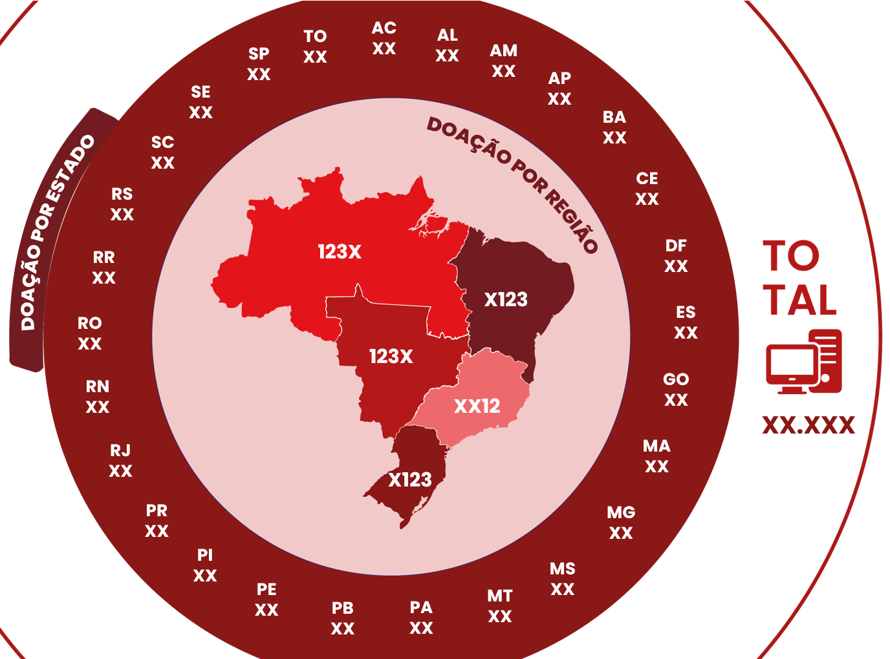
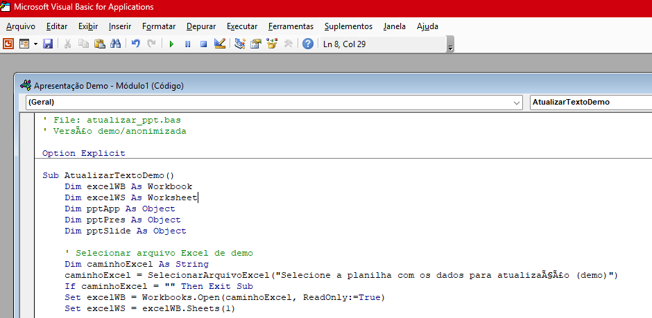

# Automatização de Apresentações PowerPoint


## Sobre o Projeto

Sistema de automação desenvolvido em VBA (Visual Basic for Applications) para atualizar apresentações PowerPoint a partir de dados consolidados em planilhas Excel. A solução realiza a integração entre tabelas dinâmicas, gráficos e mapas, preenchendo automaticamente os slides com informações atualizadas da base de dados.

O projeto foi criado para eliminar a necessidade de atualização manual de relatórios institucionais, reduzindo o tempo de preparação das apresentações e garantindo maior confiabilidade nas informações apresentadas.

---

## Screenshots

### Visão geral da automação



### Exemplo de apresentação atualizada



---

## Funcionalidades

* Integração automática entre Excel e PowerPoint
* Leitura de dados consolidados por tabelas dinâmicas
* Atualização automática de gráficos e indicadores
* Preenchimento automatizado de mapas e apresentações
* Geração de relatórios institucionais com um clique
* Redução de erros causados por atualização manual
* Economia significativa de tempo na elaboração de apresentações

---

## Tecnologias Utilizadas

| Tecnologia | Descrição                                  |
| ---------- | ------------------------------------------ |
| Excel      | Base de dados e tabelas dinâmicas          |
| VBA        | Automação do processo de atualização       |
| PowerPoint | Apresentação e visualização dos resultados |

---

## Estrutura do Projeto

* powerpoint-automation/
* |
* |--- src/ # Códigos VBA de exemplo
* |--- docs/ # Prints de demonstração
* |--- README.md

---

## Como Executar

1. Clone o repositório:

   ```bash
   git clone https://github.com/ProfissionalJV/ppt-automation.git
   ```

2. Habilite macros no Excel

3. Configure os caminhos dos arquivos Excel e PowerPoint

4. Execute a automação VBA

5. A apresentação será atualizada automaticamente com os dados mais recentes

---

## Observação

As estruturas reais e originais possuem informações privadas e de uso interno. Os códigos, planilhas e apresentações apresentados foram adaptados exclusivamente para fins de demonstração, documentação e composição de portfólio.

---

## Autor

**Victor Arsego Lêla**

* Desenvolvedor Web e Automatizador de Processos
* Engenharia da Computação - CEUB
* Gestão Pública - Estácio
* [LinkedIn](https://www.linkedin.com/in/vltech/)
